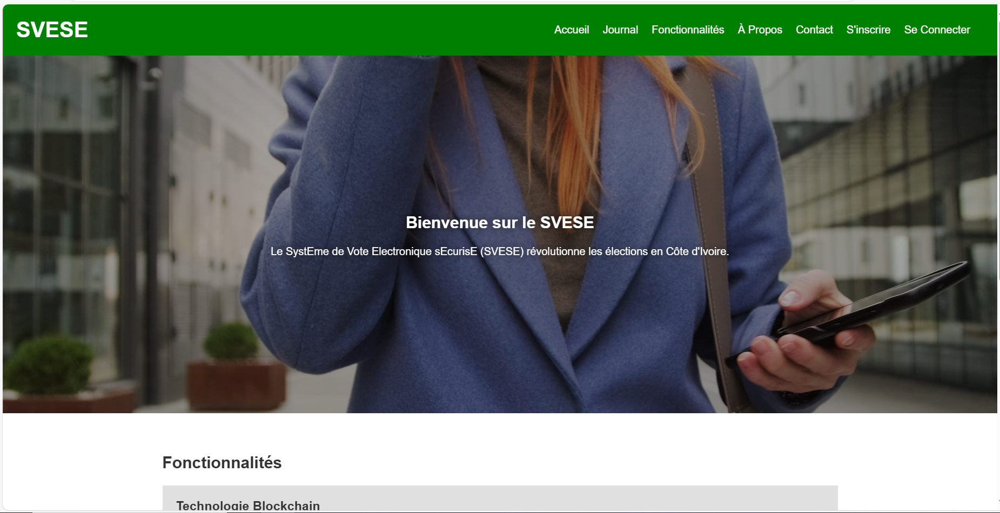

# SystEme de Vote Electronique sEcurisE (SVESE)

<!--  -->

Le SystEme de Vote Electronique sEcurisE (SVESE) est un projet innovant visant à transformer le paysage électoral en Côte d'Ivoire en utilisant des technologies modernes telles que la blockchain et le chiffrement robuste. Ce système vise à améliorer la transparence, la sécurité et l'accessibilité des élections.

## Fonctionnalités

- **Vote Électronique Sécurisé :** Utilisation de la technologie blockchain pour assurer l'intégrité des votes.
- **Accessibilité Améliorée :** Permet aux citoyens de voter électroniquement de n'importe où et à tout moment.
- **Transparence Accrue :** Vérification et audit indépendants grâce à la nature immuable de la blockchain.
- **Interface Conviviale :** Conception intuitive pour une utilisation facile par tous les citoyens.

## Captures d'écran

## Comment l'ancé le site

### Créer un environnement virtuel
`python -m venv venv`

### Activer l'environnement virtuel
#### Sur Windows
`venv\Scripts\activate`
#### Sur macOS et Linux
`source venv/bin/activate`

### Installer Flask
`pip install flask`

### Lancer le projet
`python app.py`

### Allez sur 
http://127.0.0.1:5000/

### Comment Contribuer

Si vous souhaitez contribuer au développement du SVESE, veuillez suivre ces étapes :

1. Clonez le repository : `git clone https://github.com/ChrysDavid/Systeme-de-vote-securis-.git`
2. Créez votre branche de fonctionnalité : `git checkout -b ma-nouvelle-fonctionnalite`
3. Committez vos modifications : `git commit -am 'Ajout d'une nouvelle fonctionnalité'`
4. Pushez vers la branche : `git push origin ma-nouvelle-fonctionnalite`
5. Soumettez une demande de pull request !

## Contact

Pour toute question ou suggestion, n'hésitez pas à nous contacter à l'adresse suivante : kchrysdavidbr@gmail.com

---

© 2024 SVESE. Tous droits réservés.
